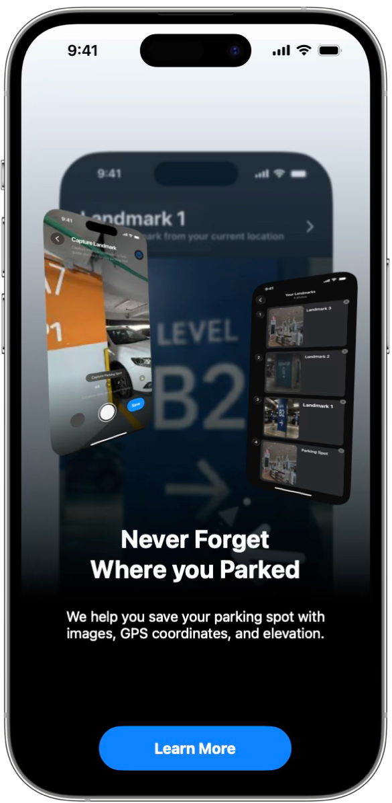
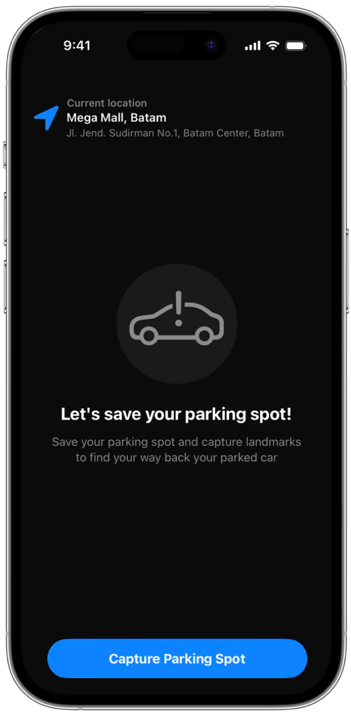
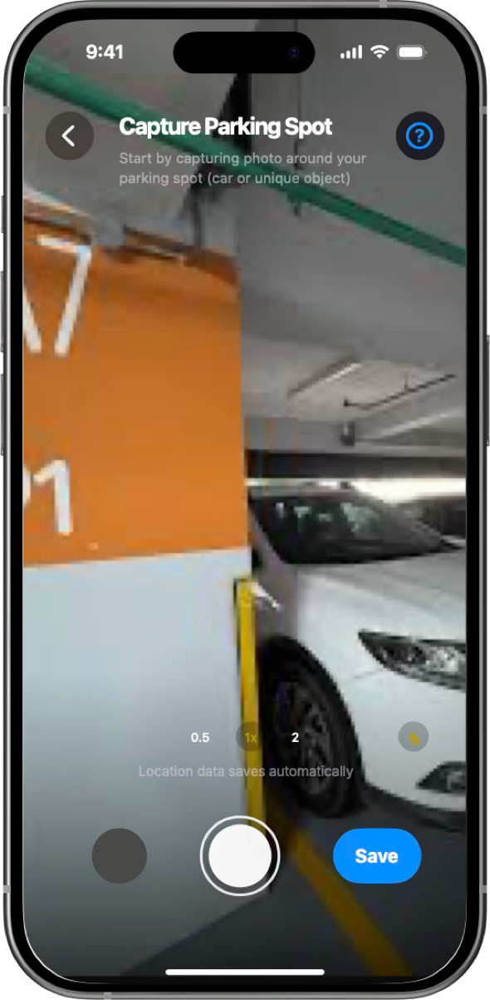
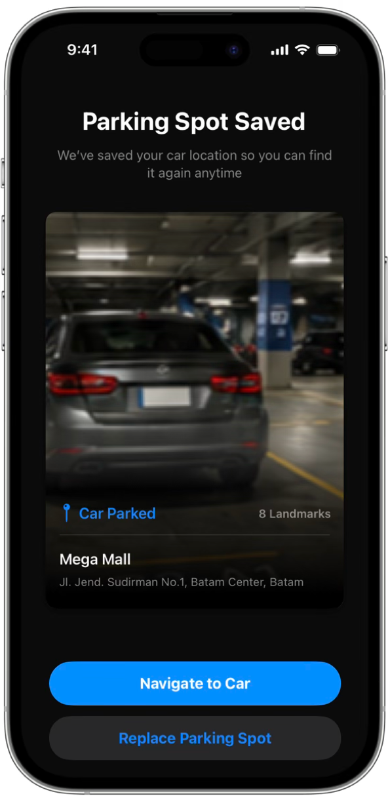
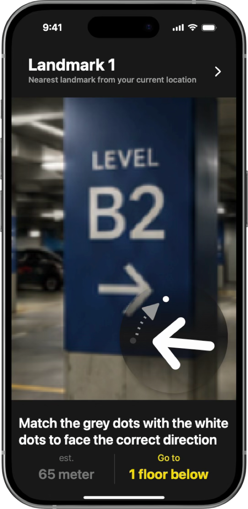

# CarPin

CarPin is an application that helps users find where they parked by using photos as reference points while saving GPS and elevation data. The app helps users locate their vehicle more quickly and efficiently, reducing the time spent searching.

## 🧠 Background

Parking areas in large malls and multi-level buildings can be confusing, making it easy to forget where you parked. In our survey, **65% of respondents** struggled to find their parking spot. CarPin helps users return to their vehicle by combining GPS, elevation data, and landmark photos.

## ✨ Features / Key Features

### 📍 Save Parking Spot

Save your parking spot by taking photos of landmarks along the way.

### 🧭 GPS-Based Navigation

The app guides you back to your parking spot with directional arrows and corresponding landmark images.

## 🛠 Tech Stack
- SwiftUI
- SwiftData
- CoreLocation
- CoreMotion
- AVFoundation

## 📷 Screenshots

    
     
    
    
    

## 👥 Team Members
- Hammam Akmal Prathama
- Kartika Amelia Rahmawati
- Kelly Angeline
- Marzandi Zahran A L
- Muhammad Fathariq Dimas O.
